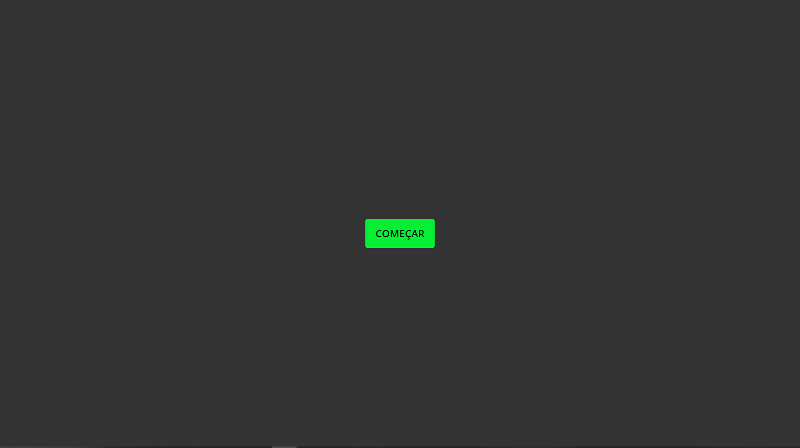

### Quiz App

Um simples Quiz, com  React e Styled Components, são cinco perguntas relacionadas a React, o usuário tem dez segundos para responder cada uma, caso não responda a tempo, a questão é considerada como errada e a próxima aparece, quando o usuário responder corretamente a borda do quiz ficará verde, quando errar ficará vermelha, existe uma barra de progresso que vai sendo preenchida a cada questão, no final do quiz é dada a quantidade de acertos do usuário. Acesse o projeto [aqui](https://quiz-app-three-orpin.vercel.app/).

